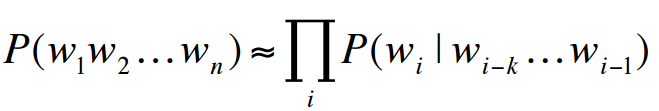

# 20190527

## Attention

### Core of probabilistic language model

Asign a probability to a sentence by Markov Assumption

### Vanilla RNN (the classic one)'s problem

* Can only handle fixed-length problem.
* Suffer from Gradient Vanishing/Exploding, hard to train when sentences are long.

To slove these, encoder-decoder model is adopted and RNN cell is changed to GRU or LSTM, tanh to Relu.

Is one hidden state really enough?

